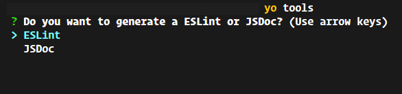

# Generator tools
It is a generator of the common tools that you usually use in your projects.  The idea of this project is to have a parent generator with which you can launch the rest of subgenerators if you want.

The subgenerators that you will be able to launch are:
* [ESLint Generator](#generator-eslint)
* [JSDoc Generator](#generator-jsdoc)

## Generators
### 1. <a name="generator-eslint" ></a>ESLint Generator
This generator will add the necessary dependencies to be able to operate the lantern.
The necessary dependencies are:
* [eslint](https://www.npmjs.com/package/eslint)
* [eslint-config-airbnb-base](https://www.npmjs.com/package/eslint-config-airbnb-base)
* [eslint-plugin-import](https://www.npmjs.com/package/eslint-plugin-import)
* [eslint-plugin-promise](https://www.npmjs.com/package/eslint-plugin-promise)

The cofiguration embodied in the .eslitrc.json file will be copied to the current repository.

You will also be given the option to use the fix option automatically using the precommit package. In this case the packages will also be installed:

* [precommit](https://www.npmjs.com/package/precommit)

### 2. <a name="generator-jsdoc" ></a>JSDoc Generator

(wip)

## Installation

First of all install yeoman and this package.
```
npm i yo
npm i generator-tools
```

Then launch the generator.
```
yo tools
```

Launching it will give you several options to run any of the subgenerators.




## keywords

```
yeoman
yeoman-generator
generators
nodejs
npm
eslint
config-eslint-airbnb-base
jsdoc
docdash
docdash-elegant
```

## License
MIT License (MIT)
Copyright © 2019 Ana Arriaga Coll
